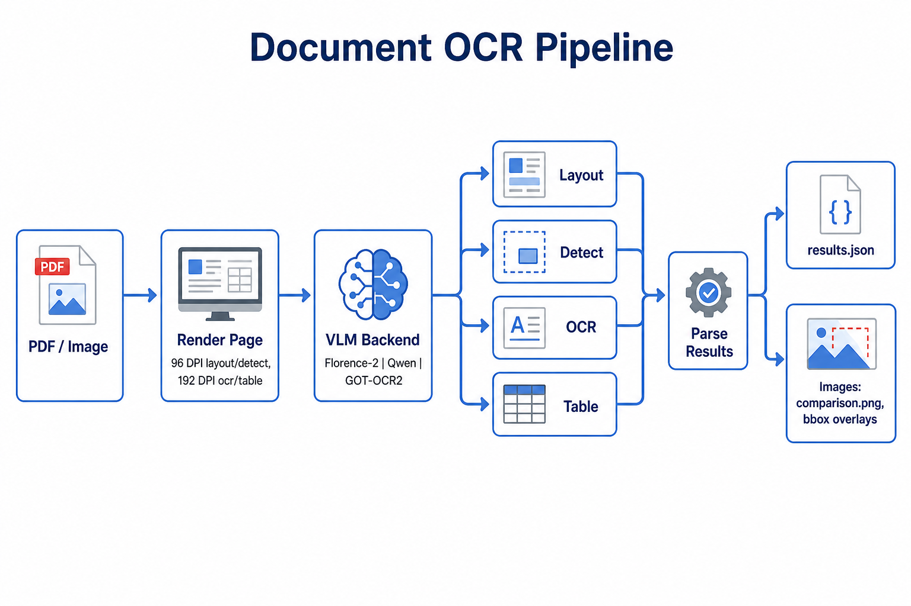
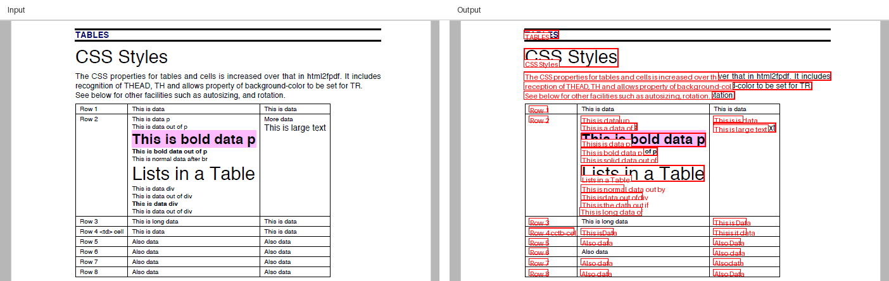

# Document OCR Pipeline

Turn a PDF or image into readable text, bounding boxes, layout blocks, or table data — using open vision-language models that run on your machine.

No server setup. No paid API. Just Python, a model, and your file.

### Pipeline overview



```
PDF or image  →  render the page  →  VLM backend  →  layout / detect / ocr / table  →  results.json + images
```

---

## Get started in a few minutes

```bash
cd suryaOCR
pip install -r requirements-vlm.txt
```

If you're working with PDFs, you'll also need poppler:

```bash
# Fedora
sudo dnf install poppler-utils

# Ubuntu / Debian
sudo apt install poppler-utils
```

Then run this on any page (PDF or PNG):

```bash
python -m vlm_pipeline page.png \
  --backend florence2 \
  --task detect --task ocr \
  --page 0 \
  --output-dir vlm_output/my_run
```

On a typical CPU that takes about a minute. When it finishes, check:

```
vlm_output/my_run/
├── results.json
└── page_0/
    ├── page_0_comparison.png             ← input (left) | output with boxes (right)
    └── page_0_detect_bbox.png            ← output overlay only
```

That's it. You now have OCR text and a visual overlay showing where each line was found.

---

## Sample files (`assets/`)

Bundled inputs you can run immediately — no need to hunt for test files.

| File | Description |
|------|-------------|
| `assets/table_page.png` | Table + CSS text (good for OCR, detect, table tasks) |
| `assets/sample.pdf` | Single-page Adobe PDF sample |

### Run the full pipeline on the table image

All four tasks — layout, OCR, table, and line detection — in one go:

```bash
python -m vlm_pipeline assets/table_page.png \
  --backend florence2 \
  --task layout --task ocr --task table --task detect \
  --page 0 \
  --max-image-size 1024 \
  --output-dir vlm_output/assets_full_pipeline
```

On CPU with Florence-2 this takes about **1–2 minutes**. Output:

```
vlm_output/assets_full_pipeline/
├── results.json                              ← layout + ocr + table + detect data
└── page_0/
    ├── page_0_comparison.png                 ← input (left) | output with boxes (right)
    ├── page_0_detect_bbox.png                ← output overlay only
    └── page_0_layout_bbox.png                ← layout overlay (if detected)
```

For higher-quality table structure, swap `florence2` for `qwen --quant int4` (much slower on CPU).

---

## Example results

Run on `assets/table_page.png` with Florence-2 (~90 sec on CPU). Full output lives in `vlm_output/assets_full_pipeline/`.

### Input vs output (side-by-side)



| Panel | What you see |
|-------|--------------|
| **Input** (left) | Original page — headings, paragraph, and table |
| **Output** (right) | Same page with red boxes and OCR label on each detected line |

### Output files

| File | Description |
|------|-------------|
| `vlm_output/assets_full_pipeline/page_0/page_0_comparison.png` | Input \| output side-by-side |
| `vlm_output/assets_full_pipeline/page_0/page_0_detect_bbox.png` | Bbox overlay only |
| `vlm_output/assets_full_pipeline/results.json` | Full JSON for all tasks |

### Sample detect output (from `results.json`)

```json
{
  "text": "TABLES",
  "bbox": [117, 15, 172, 29]
}
{
  "text": "CSS Styles",
  "bbox": [117, 44, 266, 74]
}
{
  "text": "The CSS properties for tables and cells is increased over that in HTML2PDF. It includes",
  "bbox": [117, 81, 602, 95]
}
{
  "text": "Row 1",
  "bbox": [125, 135, 154, 144]
}
{
  "text": "This is bold data p",
  "bbox": [207, 201, 328, 214]
}
{
  "text": "Also data",
  "bbox": [207, 345, 250, 355]
}
```

35 text lines detected in total. Each `bbox` is `[x1, y1, x2, y2]` in pixels.

### Sample OCR text (excerpt)

> TABLES  
> CSS Styles  
> The CSS properties for tables and cells is increased over that in html2fpdf. It includes recognition of THEAD, TH and allows property of background-color to be set for TR.  
> See below for other facilities such as autosizing, and rotation.  
> Row 1 … Row 8 … Also data …

### Task summary for this run

| Task | Result |
|------|--------|
| `detect` | 35 lines with bounding boxes |
| `ocr` | Full page text (HTML + plain text) |
| `layout` | No blocks detected (Florence-2 limitation on this page) |
| `table` | Empty table JSON — use Qwen for structured cells |

---

## What can it do?

You pick one or more tasks per run:

| Task | What you get | Overlay image? |
|------|--------------|----------------|
| `ocr` | Full page text (and HTML) | No |
| `detect` | Text lines with bounding boxes | Yes — red boxes |
| `layout` | Document blocks (title, text, figure, etc.) | Yes — blue boxes |
| `table` | Table rows and cells as JSON | No |

You can combine them: `--task detect --task ocr` is the most common pairing.

**Inputs:** `.pdf`, `.png`, `.jpg`, `.jpeg`, `.webp`, `.tif`

**Pages:** `--page 0` processes the first page (default). Use `--page-range 0-2` for multiple pages.

---

## Picking a model

There are three backends. They all use the same CLI — just change `--backend`.

| Backend | Model | Good for | Speed on CPU |
|---------|-------|----------|--------------|
| `florence2` | Florence-2-base (~230M) | Quick tests, bbox overlays | ~30–80 sec/page |
| `qwen` | Qwen2.5-VL-3B | Best text quality, tables, layout | ~15–25 min/page |
| `gotocr2` | GOT-OCR2 (~580M) | OCR on NVIDIA GPU | GPU only |

**My advice:** start with `florence2`. It's fast enough to iterate on. Switch to `qwen` when you care about accuracy — especially for tables or mixed-language pages.

### Running Qwen on CPU without running out of memory

```bash
python -m vlm_pipeline page.pdf \
  --backend qwen --quant int4 --fast \
  --task ocr --page 0
```

| Flag | On CPU | On GPU |
|------|--------|--------|
| `--quant auto` (default) | int4 via Quanto | 4-bit via bitsandbytes |
| `--quant int4` | int4 weights | — |
| `--quant none` | full float32 | bfloat16 |

The first Qwen run downloads ~6 GB of weights from Hugging Face. After that, it's cached locally.

---

## Commands you'll actually use

All of these assume you're inside the `suryaOCR/` folder.

**Just the text:**

```bash
python -m vlm_pipeline document.pdf \
  --backend florence2 \
  --task ocr \
  --page 0 \
  --output-dir vlm_output/ocr_only
```

**Text + bounding box image:**

```bash
python -m vlm_pipeline page.png \
  --backend florence2 \
  --task detect --task ocr \
  --page 0 \
  --max-image-size 1024 \
  --output-dir vlm_output/with_bbox
```

**Best quality (patient version):**

```bash
python -m vlm_pipeline document.pdf \
  --backend qwen --quant int4 --fast \
  --task ocr \
  --page 0 \
  --output-dir vlm_output/qwen_ocr
```

**Everything at once** (layout, OCR, tables, line detection):

```bash
python -m vlm_pipeline assets/table_page.png \
  --backend florence2 \
  --task layout --task ocr --task table --task detect \
  --page 0 \
  --output-dir vlm_output/full
```

With Florence-2 on CPU: ~1–2 min. With Qwen: 1–2 hours — use that when you need production-quality tables and OCR.

### Handy flags

| Flag | What it does |
|------|--------------|
| `--page 0` | First page only (default) |
| `--page-range 0-2` | Pages 0, 1, and 2 |
| `--fast` | Smaller image + fewer tokens — helps Qwen on CPU |
| `--max-image-size 1024` | Cap the longest side before sending to the model |
| `--max-tokens 512` | Limit how much text the model generates |
| `--dpi 96` | Change render resolution for PDFs |
| `--no-images` | Skip the overlay PNGs, JSON only |

---

## Understanding the output

### Folder structure

```
vlm_output/my_run/
├── results.json
└── page_0/
    ├── page_0_comparison.png      ← input on left, bbox output on right
    ├── page_0_detect_bbox.png     ← from --task detect
    └── page_0_layout_bbox.png     ← from --task layout
```

If you only ran `--task ocr`, you'll get `results.json` and nothing else. Add `--task detect` when you want the visual overlay.

### What's inside `results.json`

```json
{
  "input": "page.png",
  "backend": "florence2",
  "device": "cpu",
  "pages": [
    {
      "page_index": 0,
      "tasks": {
        "detect": {
          "text_lines": [
            { "text": "Hello world", "bbox": [10, 20, 120, 35], "confidence": 1.0 }
          ]
        },
        "ocr": {
          "text": "Hello world",
          "html": "<p>Hello world</p>"
        }
      },
      "overlay_images": ["vlm_output/my_run/page_0/page_0_detect_bbox.png"]
    }
  ]
}
```

Each `bbox` is `[x1, y1, x2, y2]` in pixel coordinates on the rendered page.

---

## Using it from Python

```python
from vlm_pipeline import DocumentVLMPipeline

pipe = DocumentVLMPipeline(backend="florence2")
result = pipe.run(
    "page.png",
    tasks=["detect", "ocr"],
    page_range=[0],
    output_dir="vlm_output/my_run",
)

print(result["results_file"])
print(result["pages"][0]["tasks"]["ocr"]["text"])
```

---

## How it works (short version)

Each task sends the page to the same model with a different prompt:

```
layout  →  "find document blocks"       (rendered at 96 DPI)
detect  →  "find text lines + boxes"    (rendered at 96 DPI)
ocr     →  "read all the text"          (rendered at 192 DPI)
table   →  "extract table structure"    (rendered at 192 DPI)
```

Higher DPI for OCR and tables because small text needs more pixels. Layout and detection work fine at lower DPI, which keeps them faster.

---

## When things go wrong

**It's taking forever.**  
You're probably on Qwen without `--fast`. Try `florence2` first — it's 10–20× faster on CPU.

**The bounding boxes look off.**  
Bump `--max-image-size` to 1024 or higher. Boxes are mapped back from the model's internal square crop to your original image, and very small inputs make that less accurate.

**Table cells are all merged into one blob.**  
Florence-2 doesn't really do tables. Switch to `--backend qwen --task table`.

**I ran OCR but there's no PNG.**  
Overlay images only come from `--task detect` or `--task layout`. OCR by itself writes JSON.

**Out of memory with Qwen.**  
Add `--quant int4` and `--fast`. Close other heavy apps. A 3B vision model is a lot for CPU RAM.

---

## Project structure

```
suryaOCR/
├── README.md
├── requirements-vlm.txt
├── assets/                  ← sample inputs + pipeline diagram
│   ├── pipeline_diagram.png
│   ├── table_page.png
│   └── sample.pdf
├── vlm_pipeline/
│   ├── __main__.py          ← CLI: python -m vlm_pipeline
│   ├── pipeline.py          ← main pipeline class
│   ├── pdf_io.py            ← load PDFs and images
│   ├── prompts.py           ← task prompts
│   ├── quant.py             ← int4 / 4-bit model loading
│   ├── visualize.py         ← draws bbox overlay PNGs
│   └── backends/
│       ├── florence2.py     ← fast, good for testing
│       ├── qwen_vl.py       ← best quality
│       └── got_ocr2.py      ← GPU OCR
└── vlm_output/              ← CLI output (results.json + overlays)
    └── assets_full_pipeline/   ← example full-pipeline run
```

---

## Dependencies

Everything is in `requirements-vlm.txt`:

- **Core:** `torch`, `transformers`, `accelerate`, `pillow`
- **PDFs:** `pdf2image` (+ system poppler)
- **Qwen vision:** `qwen-vl-utils`
- **Quantization:** `optimum-quanto` (CPU), `bitsandbytes` (GPU)
