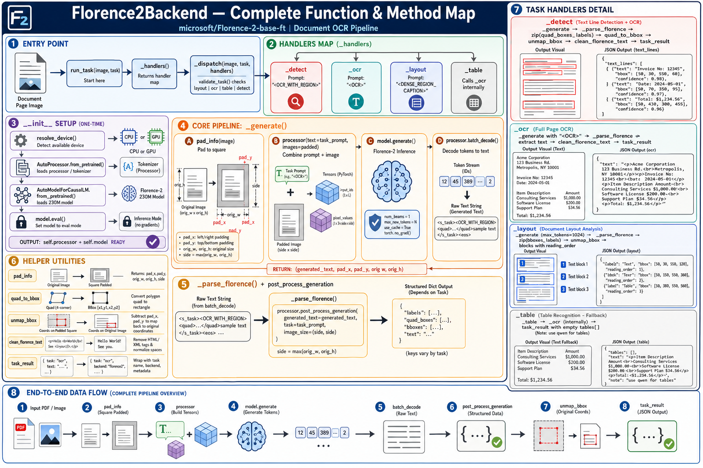

# Backends

Each backend wraps one vision-language model and exposes the same four tasks: `layout`, `ocr`, `table`, and `detect`.

```
CLI (--backend florence2)
        │
        ▼
  get_backend(name)          ← __init__.py registry
        │
        ▼
  Florence2Backend.run_task(image, task)
        │
        ▼
  _dispatch → task handler → JSON result
```

| File | Class | Model | Best for |
|------|-------|-------|----------|
| `florence2.py` | `Florence2Backend` | `microsoft/Florence-2-base-ft` | Fast CPU runs, bbox overlays |
| `qwen.py` | `QwenVLBackend` | `Qwen/Qwen2.5-VL-3B-Instruct` | Best OCR, tables, layout |
| `got_ocr2.py` | `GotOcr2Backend` | `stepfun-ai/GOT-OCR2_0` | GPU-only OCR |
| `base.py` | `VLMBackend` | — | Shared base class |

Weights live in `models/<model_name>/`. Backend **code** lives here in `vlm_pipeline/backends/`.

---

## Base class (`base.py`)

All backends inherit from `VLMBackend`.

| Method | What it does |
|--------|--------------|
| `resolve_device()` | Picks `cuda` if a GPU is available, otherwise `cpu`. |
| `validate_task(task)` | Raises an error if the task is not one of `layout`, `ocr`, `table`, `detect`. |
| `_dispatch(image, task, handlers)` | Looks up the handler for `task` and calls it. |
| `task_result(task, **payload)` | Wraps output as `{task, backend, ...payload}`. |
| `run_task()` | Abstract — each backend implements this. |

---

## Florence-2 backend (`florence2.py`)

Default backend. Uses Microsoft Florence-2 with task-specific prompts like `<OCR>` and `<OCR_WITH_REGION>`.

### Function flow diagram



### End-to-end path

```
Page image
  → run_task(image, "detect")
  → _dispatch → _detect
  → _generate (pad + model inference)
  → _parse_florence (post_process_generation)
  → quad_to_bbox + unmap_bbox
  → task_result with text_lines[]
```

### Methods in `Florence2Backend`

#### `__init__(model_id, device, quant)`

One-time setup when the backend is created.

1. `resolve_device()` — CPU or GPU.
2. `AutoProcessor.from_pretrained()` — loads the tokenizer + image processor.
3. `AutoModelForCausalLM.from_pretrained()` — loads the ~230M Florence-2 weights.
4. `model.eval()` — inference mode (no training gradients).

#### `run_task(image, task)`

Entry point. Builds the handler map via `_handlers()` and passes control to `_dispatch()` from the base class.

#### `_handlers()`

Returns the task → method map:

| Task | Handler | Florence prompt |
|------|---------|-----------------|
| `detect` | `_detect` | `<OCR_WITH_REGION>` |
| `ocr` | `_ocr` | `<OCR>` |
| `layout` | `_layout` | `<DENSE_REGION_CAPTION>` |
| `table` | `_table` | (calls `_ocr` internally) |

#### `_generate(image, task_prompt, max_new_tokens=2048)`

Shared inference step used by every task handler.

| Step | Call | Purpose |
|------|------|---------|
| A | `pad_info(image)` | Pad the page to a square; record `pad_x`, `pad_y`, `orig_w`, `orig_h`. |
| B | `processor(text, images)` | Turn prompt + image into `input_ids` and `pixel_values` tensors. |
| C | `model.generate(...)` | Run Florence-2; output token IDs. |
| D | `processor.batch_decode(...)` | Decode tokens to a raw text string. |

**Returns:** `(generated_text, pad_x, pad_y, orig_w, orig_h)`

#### `_parse_florence(task_prompt, generated_text, pad_x, pad_y, orig_w, orig_h)`

Turns raw model text into structured data.

1. Compute `side = max(orig_w, orig_h)`.
2. Call `processor.post_process_generation(generated_text, task=task_prompt, image_size=(side, side))`.
3. Returns a dict — keys depend on the task (`labels`, `quad_boxes`, `bboxes`, or plain `text`).

**Returns:** `(parsed_dict, pad_x, pad_y, orig_w, orig_h)`

#### `_detect(image)`

Detect every text line and its bounding box.

1. `_generate` with `<OCR_WITH_REGION>`.
2. `_parse_florence` → get `quad_boxes` and `labels`.
3. For each pair: `quad_to_bbox` → `unmap_bbox` → `clean_florence_text`.
4. `task_result("detect", text_lines=[{text, bbox, confidence}])`.

#### `_ocr(image)`

Read all visible text on the page.

1. `_generate` with `<OCR>`.
2. `_parse_florence` → extract text string.
3. `clean_florence_text` → strip HTML tags.
4. `task_result("ocr", text=..., html=<p>...</p>)`.

#### `_layout(image)`

Find document regions (blocks) with captions.

1. `_generate` with `<DENSE_REGION_CAPTION>` (max 1024 tokens).
2. `_parse_florence` → get `bboxes` and `labels`.
3. `unmap_bbox` each box back to original image coordinates.
4. `task_result("layout", blocks=[{label, bbox, reading_order, caption}])`.

#### `_table(image)`

Florence-2 has limited table support. This handler calls `_ocr` and returns empty `tables[]` with a note to use the Qwen backend for structured table JSON.

### Helper utilities (`vlm_pipeline/utils/florence.py`)

Used by `florence2.py`:

| Function | Input → Output | Purpose |
|----------|----------------|---------|
| `pad_info(image)` | PIL image → padded square + offsets | Florence-2 expects a square input |
| `quad_to_bbox(quad)` | 8-point quad → `[x1, y1, x2, y2]` | Convert region polygon to rectangle |
| `unmap_bbox(bbox, pad_x, pad_y, orig_w, orig_h)` | Padded coords → original coords | Shift boxes back to the real page size |
| `clean_florence_text(text)` | Raw string → clean string | Remove HTML tags from model output |

---

## Qwen backend (`qwen.py`)

Uses Qwen2.5-VL with natural-language prompts from `vlm_pipeline/utils/prompts.py`.

| Method | What it does |
|--------|--------------|
| `__init__` | Loads model with optional int4/4bit quantization. |
| `_ask(image, prompt)` | Saves image to temp file, builds chat messages, calls `model.generate`. |
| `_run_prompt_task(image, task)` | Picks prompt from `TASK_PROMPTS`, parses JSON from response. |
| `run_task(image, task)` | Entry point → `_run_prompt_task`. |

Best for production-quality OCR, layout JSON, and table extraction.

---

## GOT-OCR2 backend (`got_ocr2.py`)

GPU-only dedicated OCR model.

| Method | What it does |
|--------|--------------|
| `__init__` | Loads model; raises if no CUDA GPU. |
| `_chat(image, ocr_type)` | Calls `model.chat(tokenizer, image, ocr_type=...)`. |
| `_got_ocr / _got_table / _got_detect / _got_layout` | Task handlers using different `ocr_type` values. |
| `run_task(image, task)` | Entry point → `_dispatch`. |

---

## Adding a new backend

1. Create `my_backend.py` with a class extending `VLMBackend`.
2. Set `name = "mybackend"`.
3. Implement `run_task(image, task, max_new_tokens)`.
4. Register in `__init__.py`:

```python
from vlm_pipeline.backends.my_backend import MyBackend

BACKEND_REGISTRY["mybackend"] = MyBackend
```

5. Add the Hugging Face model id to `vlm_pipeline/utils/models.py` → `BACKEND_MODEL_IDS`.
